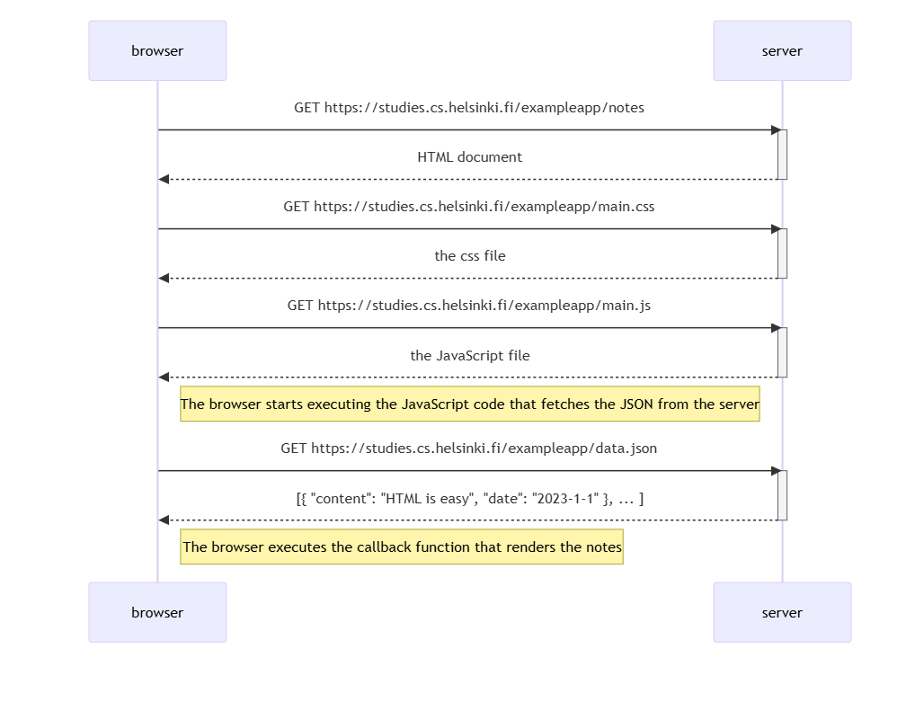

# 2026-07-06 — Full Stack Open: Part 0 — SPA Sequence Diagram

**Member:** Kabin Baniya
**Date:** 2026-07-06

---

## Topic
Full Stack Open — Part 0: How browsers load web apps

---

## Sequence Diagram

---

## Key Takeaway
Each asset (HTML, CSS, JS) is a separate HTTP request. Once JS loads, it fetches JSON from the server and updates the DOM without reloading the page — this is the foundation of Single Page Applications.

---

